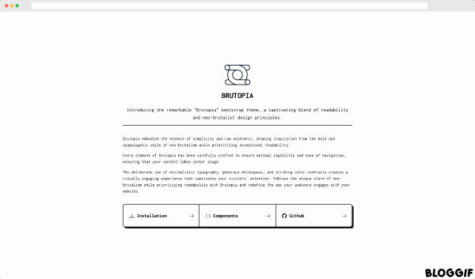

<h1 align="center">BRUTOPIA</h1>

<p align="center">
 
</p>
<p align="center">Introducing the remarkable "Brutopia" bootstrap theme, a captivating blend of readability and neo-brutalist design principles..</p>
----
<h2 align="center">
	<a href="https://rajnandan1.github.io/brutopia/dist/index.html">Demo Page</a>
</h2>
* * *
## About

Brutopia embodies the essence of simplicity and raw aesthetic, drawing inspiration from the bold and unapologetic style of neo-brutalism while prioritizing exceptional readability.

Every element of Brutopia has been carefully crafted to ensure optimal legibility and ease of navigation, ensuring that your content takes center stage.

The deliberate use of minimalistic typography, generous whitespace, and striking color contrasts creates a visually engaging experience that captivates your visitors' attention. Embrace the unique charm of neo-brutalism while prioritizing readability with Brutopia and redefine the way your audience engages with your website.
 

## Installation

Instead of Using the default bootstrap CSS include the below CSS file 


```html
<link href="https://cdn.jsdelivr.net/gh/rajnandan1/brutopia@latest/dist/assets/compiled/css/app.css" rel="stylesheet" crossorigin="anonymous">
```

Rest everything is same

